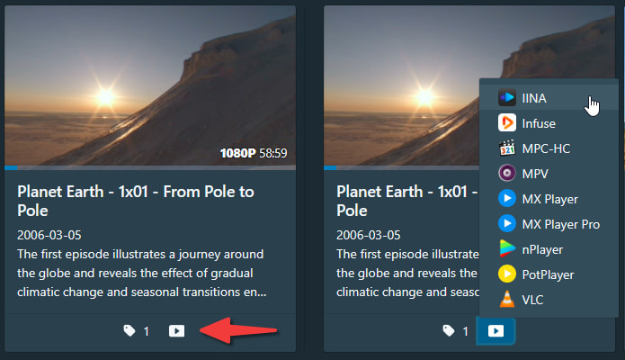
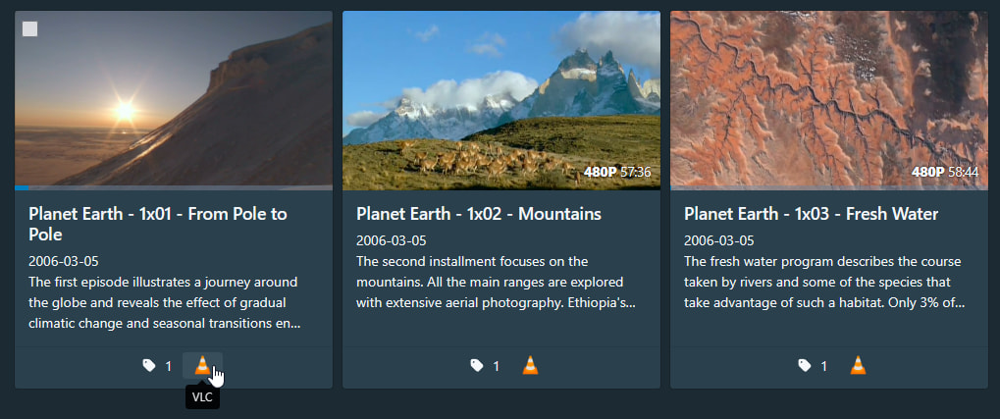
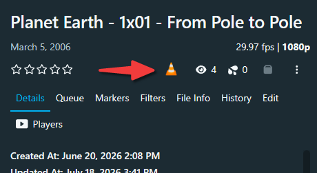

[English](README.md) | [简体中文](README.zh-Hans.md)

---

# External Player Launcher

This plugin allows you to launch external media players directly from scene cards and scene detail pages to play videos.

Because browsers only support a limited set of video formats, some formats (such as AVI, MKV, and RMVB) often require transcoding before playback.

This plugin hands playback off to external media players to bypass browser format limitations, allowing you to play a wider range of video formats without transcoding. You can also use the full feature set of your media player—including subtitles, audio tracks, playback controls, and more—while avoiding transcoding delays and quality loss.

## Features

- Adds a player dropdown at the bottom of scene cards for quickly choosing an external player.
- When **Single Player Mode** is enabled, the player dropdown is replaced by a single player button for one-click playback.
- Supports launching an external player from scene detail pages.
- Lets you show or hide individual player buttons in settings as needed.
- Lets you independently control whether player buttons are shown on scene cards, in the **Players** tab, and in the toolbar on scene detail pages.
- Settings are stored only in the current browser, so you can configure players independently on different devices.

## Screenshots

Scene card:

Scene card (single player mode):

Scene detail page:

Scene detail page toolbar (single player mode):

## Supported Players

The currently supported players and their platforms:

⚠️ Note: Some players require additional tools to function properly.

| Player | Windows | Android | iOS | macOS | Linux |
|--------|---------|---------|-----|-------|-------|
| IINA | | | | ✅ | |
| Infuse | | | ✅ | ✅ | |
| MPC-HC | ✅ (requires [mpc-protocol](https://github.com/muse90673/mpc-protocol/tree/develop)) | | | | |
| MPV | ✅ (requires [mpv-handler](https://github.com/akiirui/mpv-handler)) | ✅ | ✅ | | ✅ (requires [mpv-handler](https://github.com/akiirui/mpv-handler)) |
| MX Player (Pro) | | ✅ | | | |
| nPlayer | | | ✅ | ✅ | |
| PotPlayer | ✅ | | | | |
| VLC | ✅ (requires [vlc-protocol](https://github.com/muse90673/vlc-protocol/tree/develop)) | ✅ | ✅ | ✅ (requires [vlc-protocol](https://github.com/muse90673/vlc-protocol/tree/develop)) | ✅ (requires [vlc-protocol](https://github.com/muse90673/vlc-protocol/tree/develop)) |

## Installing the Plugin

1. In Stash, open **Settings** → **Plugins**.
2. Click **Add Source** and fill in the following:
   - **Name**: `esumaka plugin repo`
   - **Source URL**: `https://esumaka.github.io/stash-plugin-repo/main/index.yml`
3. Click **Confirm** to add the source.
4. Select `External Player Launcher` from the list of Available Plugins and click **Install**.
5. Refresh the Stash page for the plugin to take effect.

## Usage

- Make sure a supported player is installed. See [Supported Players](#supported-players).
- Click the player icon at the bottom of a scene card, then select the desired player from the menu.
- Alternatively, open a scene detail page, switch to the **Players** tab, and click the desired player button.
- Your browser may display a dialog like "trying to open xxx?". Click **Open** to proceed.

## Warning

This plugin may conflict with other plugins that modify scene cards, causing player buttons to disappear or appear in the wrong position.

## Development

### Requirements

- [Node.js](https://nodejs.org/) >= 20.11.0
- [pnpm](https://pnpm.io/)

### Initialization and Configuration

- Install dependencies:
  - Run `pnpm install --frozen-lockfile`
- Configure environment variables:
  - Copy the `.env.example` file and rename it to `.env`.
  - Set `STASH_PLUGINS_DIR` in `.env` to your local Stash plugins directory.
  - Set `STASH_SOURCE_INDEX_DIR` in `.env` to the directory of the plugin source index repository, typically its `plugins` folder.

### Build the Plugin

- Run `pnpm build`, or run the `build` script under **Explorer** → **NPM Scripts** in Visual Studio Code.
- Build output is written to the project's `dist` folder.

### Deploy to Local Stash (for debugging)

- Run `pnpm deploy`, or run the `deploy` script under **Explorer** → **NPM Scripts** in Visual Studio Code.
- Build output is copied to the directory specified by `STASH_PLUGINS_DIR`.
- In Stash, open **Settings** → **Plugins**, click **Reload Plugins**, and then refresh the Stash page.

### Release the Plugin

- Run `pnpm release`, or run the `release` script under **Explorer** → **NPM Scripts** in Visual Studio Code.
- Build output is written to the directory specified by `STASH_SOURCE_INDEX_DIR`.

## Acknowledgements

Parts of this plugin's code are derived from:

- [bpking1/embyExternalUrl](https://github.com/bpking1/embyExternalUrl) (MIT License)
  - [embyLaunchPotplayer.js](https://github.com/bpking1/embyExternalUrl/blob/main/embyWebAddExternalUrl/embyLaunchPotplayer.js)

## Contributing

Pull requests and issues are welcome.

## Changelog

### 1.2.0

- Added player buttons to the scene detail page toolbar.
- Added a setting to show or hide player buttons in the scene detail page toolbar.
- Saving settings on the scene detail page now automatically refreshes the current page so the **Display Locations** settings take effect immediately.
- Refined the UI text and documentation for clearer, more consistent wording.

### 1.1.0

- Added the **Display Locations** settings group, allowing you to independently show or hide player buttons on scene cards and scene detail pages.
- Reorganized the settings UI into **Display Locations** and **Player Settings** groups for a clearer structure.
