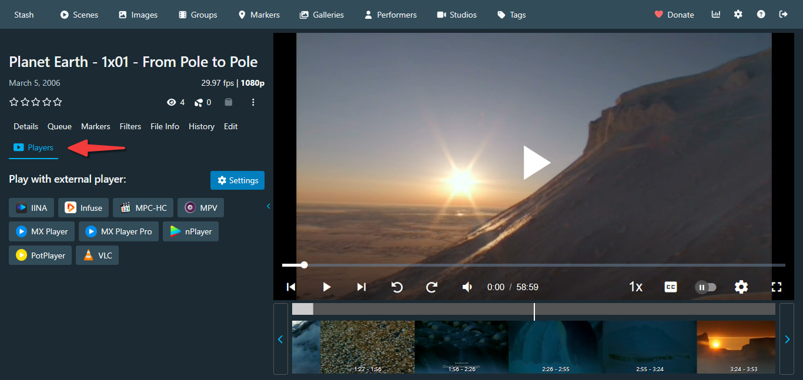

[English](README.md) | [简体中文](README.zh-Hans.md)

---

# External Player Launcher

该插件添加了对某些媒体播放器的支持，可以在短片卡片和短片详情页中选择播放器播放视频。

## 特性

- 在短片卡片底部添加播放器下拉菜单，方便快速选择外部播放器
- 开启"单播放器模式"后，下拉菜单将替换为单个播放器按钮，一键播放
- 短片详情页同样支持打开外部播放器
- 在设置中可按需显示或隐藏各个播放器
- 可独立控制在短片卡片和短片详情页中是否显示播放器按钮
- 设置仅在当前浏览器生效，因此不同设备可以配置不同的播放器

## 截图

短片卡片：

短片卡片（单播放器模式）：

短片详情：

## 支持的播放器

目前支持的媒体播放器和操作系统：

⚠️注意，某些播放器需要安装额外的工具才能正常启动

| 播放器 | Windows | Android | iOS | macOS | Linux |
|--------|---------|---------|-----|-------|-------|
| IINA | | | | ✅ | |
| Infuse | | | ✅ | ✅ | |
| MPC-HC | ✅ (需要 [mpc-protocol](https://github.com/muse90673/mpc-protocol/tree/develop)) | | | | |
| MPV | ✅ (需要 [mpv-handler](https://github.com/akiirui/mpv-handler)) | ✅ | ✅ | | ✅ (需要 [mpv-handler](https://github.com/akiirui/mpv-handler)) |
| MX Player (Pro) | | ✅ | | | |
| nPlayer | | | ✅ | ✅ | |
| PotPlayer | ✅ | | | | |
| VLC | ✅ (需要 [vlc-protocol](https://github.com/muse90673/vlc-protocol/tree/develop)) | ✅ | ✅ | ✅ (需要 [vlc-protocol](https://github.com/muse90673/vlc-protocol/tree/develop)) | ✅ (需要 [vlc-protocol](https://github.com/muse90673/vlc-protocol/tree/develop)) |

## 安装插件

1. 在 Stash 中进入 **设置** → **插件**
2. 点击 **添加源**，填入以下信息：
   - **名称**: `esumaka plugin repo`
   - **来源 URL**: `https://esumaka.github.io/stash-plugin-repo/main/index.yml`
3. 点击 **确认** 添加源
4. 在可用插件列表中选择 `External Player Launcher` ，点击 **安装**
5. 刷新 Stash 页面使插件生效

## 使用方法

- 确保已安装受支持的播放器，见 [支持的播放器](#支持的播放器)
- 点击短片卡片底部的播放器图标，在弹出的下拉菜单中选择想要的播放器
- 或者进入短片详情页面，点击“播放器”标签，然后点击想要的播放器按钮
- 浏览器可能弹出“尝试打开xxx”的对话框，点击“打开”按钮即可

## 警告

该插件可能会与其他修改了短片卡片的插件冲突，可能导致播放器按钮消失、显示位置不正确等。

## 开发

### 前置要求

- [Node.js](https://nodejs.org/) >= 20.11.0
- [pnpm](https://pnpm.io/)

### 初始化与配置

- 安装依赖：
  - 运行 `pnpm install --frozen-lockfile`
- 配置环境变量：
  - 复制 `.env.example` 文件并重命名为 `.env`
  - 设置 `.env` 的 `STASH_PLUGINS_DIR` 为本地 Stash 插件目录
  - 设置 `.env` 的 `STASH_SOURCE_INDEX_DIR` 为插件源索引仓库的目录，通常为仓库的 `plugins` 文件夹。

### 构建插件

- 运行 `pnpm build`，或者在 Visual Studio Code 的 **资源管理器 → NPM脚本** 中，点击运行 `build` 脚本。
- 构建产物会被输出到项目的 `dist` 文件夹中

### 部署到本地 Stash（开发调试）

- 运行 `pnpm deploy`，或者在 Visual Studio Code 的 **资源管理器 → NPM脚本** 中，点击运行 `deploy` 脚本。
- 在 Stash 的 **设置** → **插件** 页面中点击 **重载插件**，然后刷新 Stash 页面使插件生效。

### 发布插件

- 运行 `pnpm release`，或者在 Visual Studio Code 的 **资源管理器 → NPM脚本** 中，点击运行 `release` 脚本。

## 致谢

本插件部分代码来自：
- [bpking1/embyExternalUrl](https://github.com/bpking1/embyExternalUrl) (MIT License)
  - [embyLaunchPotplayer.js](https://github.com/bpking1/embyExternalUrl/blob/main/embyWebAddExternalUrl/embyLaunchPotplayer.js)

## 贡献代码

欢迎提交 Pull Request 或 Issue。

## 更新日志

### 1.1.0

- 新增"入口设置"设置分组，可独立控制短片卡片和短片详情页中播放器按钮的显示与隐藏
- 设置界面重新分组（入口设置 / 播放器设置），结构更清晰
